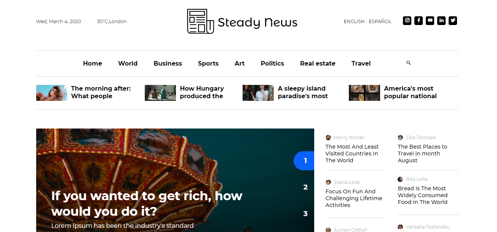

## Introduction
SteadyNews is a responsive news and blog portal CMS script. It has a nice and attractive front end interface that is really appealing. Also the backend has a lot of awesome features that are needed for a modern and professional newspaper website. Almost all kinds of task can be done using the admin panel without having any kind or programming language knowledge

## Screenshots

## Technologies
* Node.js
* Express.js